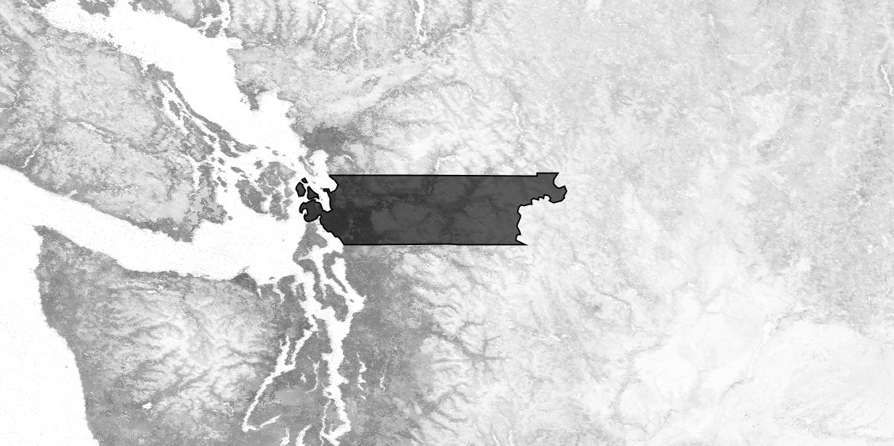
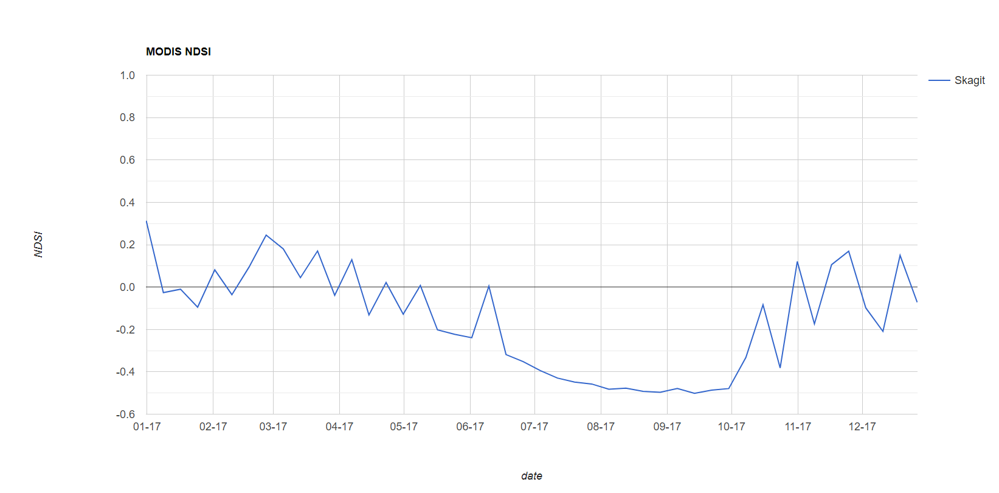
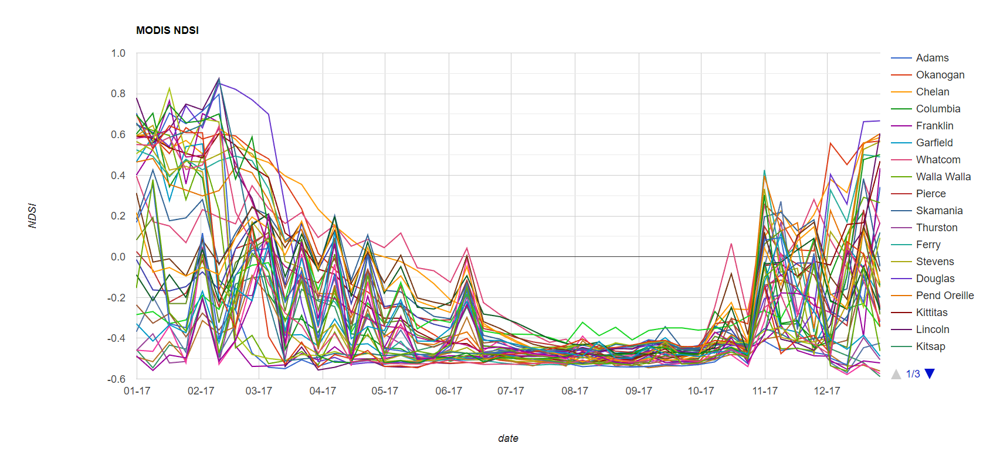
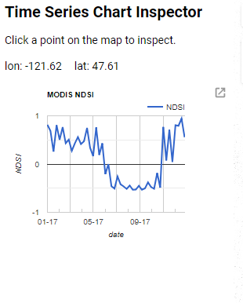

## Overview

This code allows users to dynamically generate time series plots for from points that are dynamically chosen on a map on the fly. The time series show the 8 day composites of Normalized Difference Snow Index at 250 m resolution. These indices are derived from MODIS.

Link to a static version of the full script used in this module:
[https://code.earthengine.google.com/a47b635ed6a11a99199674364afb9944](https://code.earthengine.google.com/a47b635ed6a11a99199674364afb9944)

## Define User Specifications

This script is structured to make it easy for the user to select different images, dates and regions. For this exercise, we are going to leave the parameters as they are to set the extent as a study area in Skagit County, Washington.


// load county boundaries and select Skagit County in Washington
var counties = ee.FeatureCollection('ft:1ZMnPbFshUI3qbk9XE0H7t1N5CjsEGyl8lZfWfVn4');
// state number for WA: 53, county number for Skagit: 57
var roi = counties.filter(ee.Filter.eq('STATEFP',53)).filter((ee.Filter.eq('COUNTYFP',57)));


 

## Load MODIS Surface Reflectance and Calculate NDSI

NDSI is a spectral index calculated from green and shortwave-infrared bands. Here, we are deriving our own NDSI from MODIS 8 day composite surface reflectance product using the `normalizedDifference` function. NDSI ranges from -1 to 1, with values greater than 0 generallyconsidered to have snow present.



// load modis 8 day surface reflectance and filter to 2017
var Modis = ee.ImageCollection('MODIS/006/MOD09A1')
  .filterDate('2017-01-01','2017-12-31')
  
// write function to calculate snow index using band 4 (green) and band 6 (SWIR)
var calcNDSI = function(img) {
  var ndsi = img.normalizedDifference(['sur_refl_b04','sur_refl_b06']).rename('NDSI')
  return img.addBands(ndsi)
}

// map function over modis collection
var NDSI = Modis.map(calcNDSI).select('NDSI')

// visualize maximum snow index from throughout the year and add region of interest above snow index layer
var maxSnow = NDSI.max()
Map.addLayer(maxSnow, {min: -1, max: 1}, 'NDSI')
Map.addLayer(roi, {}, 'Counties');
Map.centerObject(roi,7);


 

  

## Make plot of average NDSI by region

Here we make a plot of 8-day spatially averaged NDSI in Skagit County. The following code creates a chart and maps a spatial mean reducer across each image in the MODIS collection, using the Skagit County border as our region. We then print the chart to show it in the console.


 
 // Plot NDSI ---------------------------------------------------------------------------------------------
var SnowChart = ui.Chart.image.seriesByRegion({
  imageCollection: NDSI,
  regions: roi,
  reducer: ee.Reducer.mean(), //type of reduction. See ee.Reducers for other kinds of reductions
  scale: 500, //spatial scale of MODIS product
  seriesProperty: 'NAME'  //property of roi to display in map
})
  .setOptions({
    title: 'MODIS NDSI',
    vAxis: {title: 'NDSI', maxValue: 1, minValue: -1},
    hAxis: {title: 'date', format: 'MM-yy', gridlines: {count: 12}},
  })

print(SnowChart)



 

  

The type of chart we use ("seriesByRegion") accepts mutiple regions as input and reduces the image collection in each region individually. Try returning to the line where we selected Skagit County and remove the "COUNTYFP" filter. This will result in all counties in Washington being selected. Running the code again will result in a timeseries plot of averaged NDSI in all counties.


//Comment out COUNTYFP filter
var roi = counties.filter(ee.Filter.eq('STATEFP',53))//.filter((ee.Filter.eq('COUNTYFP',57)));


 

  

## Create a User Interface

You can alter the client-side user interface (UI) through the ui package by adding widgets to the Code Editor interface. You can read about the ui package in the [UI Overview section](https://developers.google.com/earth-engine/ui) of the Developers Guide
The general idea is that you make a widget, which could be simple (a button) or complex (a chart). Then you define the behavior of the widget and then add it to the display. Here we create a panel, define the contents of the panel using labels, and create a callback function so the user can click a point and it will record the lat/long as an object called `points.` You can read more about how to define the panel and layouts in the [Panels section](https://developers.google.com/earth-engine/ui_panels) of the Developers Guide.



// Create User Interface portion --------------------------------------------------
// Create a panel to hold our widgets.
var panel = ui.Panel();
panel.style().set('width', '300px');

// Create an intro panel with labels.
var intro = ui.Panel([
  ui.Label({
    value: 'Time Series Chart Inspector',
    style: {fontSize: '20px', fontWeight: 'bold'}
  }),
  ui.Label('Click a point on the map to inspect.')
]);
panel.add(intro);

// panels to hold lon/lat values
var lon = ui.Label();
var lat = ui.Label();
panel.add(ui.Panel([lon, lat], ui.Panel.Layout.flow('horizontal')));

// Register a callback on the default map to be invoked when the map is clicked
Map.onClick(function(coords) {
  // Update the lon/lat panel with values from the click event.
  lon.setValue('lon: ' + coords.lon.toFixed(2)),
  lat.setValue('lat: ' + coords.lat.toFixed(2));
  var point = ee.Geometry.Point(coords.lon, coords.lat);
  

## Add the time series plots to the panels

Now that we have set up our user interface and built the call-back, we can define a time series chart. The chart uses the lat/long selected by the user and builds a time series for NDSI at that point. It takes the average NDSI at that point, extracts it, and then adds it to the time series. This series is then plotting as a chart.

  

  // Create an MODIS NDSI chart.
  var ndsiChart = ui.Chart.image.series(NDSI, point, ee.Reducer.mean(), 500);
  ndsiChart.setOptions({
    title: 'MODIS NDSI',
    vAxis: {title: 'NDSI', maxValue: 1, minValue: -1},
    hAxis: {title: 'date', format: 'MM-yy', gridlines: {count: 7}},
  });
  panel.widgets().set(2, ndsiChart);

});

Map.style().set('cursor', 'crosshair');

// Add the panel to the ui.root.
ui.root.insert(0, panel);


You should see something like this appear in the bottom left:

 

  

## Extracting Time Series Data for larger regions or more points

If you are computing the indices on the fly, or you have many points or areas of interest, you may have the unpleasant experience of your code timing out. One way to avoid that is to just export the time series as a .csv to Google Drive or Cloud Storage. An example of how to do this can be found in [Episode 04: Reducers](https://mbonnema.github.io/GoogleEarthEngine/04-reducers/) of this tutorial.
