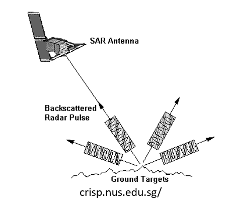
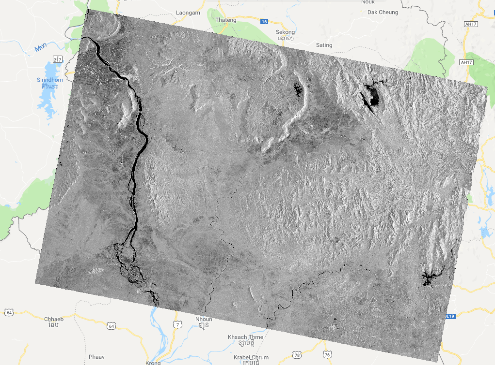
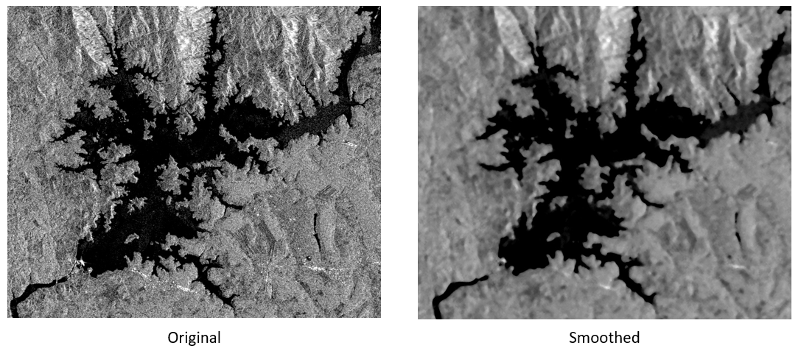
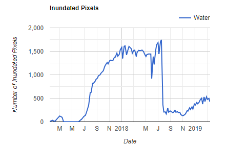
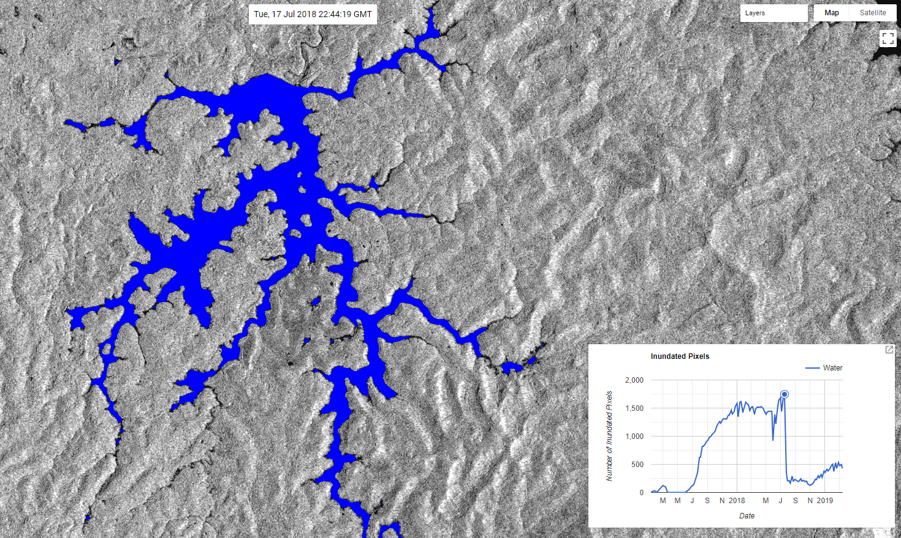

## Overview

This code plots a timeseries of water surface area in a region and allows the user to click on the plot and display the classified image which produced the selected data point. Water classification is derived from Sentinel-1 Synthetic Aperture Radar (SAR). A new reservoir in the Mekong River Basin is used as an exaple for this problem.

Link to a static version of the full script used in this module:
[https://code.earthengine.google.com/a47b635ed6a11a99199674364afb9944](https://code.earthengine.google.com/a47b635ed6a11a99199674364afb9944)

## Define Region

This script is structured to make it easy for the user to select different regions or time periods. We are going to use a reservoir in the Mekong River Basin as an example. Note that it looks like there isn't anything there at first, becasue the dam was constructed very recently (June, 2017)


// Load region defined by polygon and add it to the map
var roi = ee.Geometry.Polygon(
        [[[106.5311175986817, 14.88401360239504],
          [106.70144574301412, 14.88567468158789],
          [106.68221660149186, 14.996475939738637],
          [106.67432540134314, 15.050880175819685],
          [106.61113258648004, 15.046083385875264],
          [106.53764487153217, 15.035961287202868],
          [106.52682423644103, 14.968444128060433]]]);
Map.addLayer(roi, {}, 'ROI')
Map.centerObject(roi, 8)


 

## Load Sentinel-1 SAR collection and filter to our region

A major limitation of visible satellite imagery is the presence of clouds. In a region like the Mekong Basin, where it is cloudy during monsoon season, it is very difficult to create a visible timeseries of the earth surface. SAR sensors, like Sentinel-1, use radar waves, which penetrate clouds, allowing us to get a view of the earth surface, even when clouds are present. SAR works by sending a radar signal from the satellite towards the earth at an off nadir angle (i.e. not straight down, but at an angle). The signal hits the earth and scatters and the satellite measures how much backscatter returns to the satellite. The amount of backscatter is determined in part by the roughness of the surface, with smoother surfaces scattering less. Large flat surfaces like water scatter very little and stand out as dark spots against relatively high scattering land surface.

 

  

Here we load the Sentinel-1 collection and filter for images of our region taken after 2017. We also filter for type of signal recieved. "VV" stands for vertical transmit, vertical recieved. This means that both the signal transnmited from and recieved by from the satellite is vertically polarized. Some surfaces alter the polarization of the radar signal, but for water body detection, this is usually unused. We only care that all of our images have the same kind of transmit/recieve polarizations.



//Load Sentinel-1 SAR collection and filter according to data collection type
var S1 = ee.ImageCollection('COPERNICUS/S1_GRD')
  .filterBounds(roi)
  .filterDate('2017-01-01','2019-04-01')
  .filter(ee.Filter.listContains('transmitterReceiverPolarisation', 'VV'))

//Add first image to map to get an idea of what a SAR image looks like  
Map.addLayer(S1.first(),{bands: 'VV',min: -18, max: 0}, 'SAR image')



 

  

## Filter Speckles

SAR images typically have speckle noise that degrades the quality of the image. Zoom into some of the water bodies in the image and you will find tiny bright dots. These dots will make it difficult to classify the image as those bright speckles will be classified as land. There are a number of different techniques for dealing with speckles. We are going to use a very simple method, apply a focal median filter. This filter looks at each pixel and its neighboring pixels and takes the median. We then map this focal median process across all images in the collection.


 
// Filter speckle noise
var filterSpeckles = function(img) {
  var vv = img.select('VV') //select the VV polarization band
  var vv_smoothed = vv.focal_median(100,'circle','meters').rename('VV_Filtered') //Apply a focal median filter
  return img.addBands(vv_smoothed) // Add filtered VV band to original image
}

// Map speckle noise filter across collection. Result is same collection, with smoothed VV band added to each image
S1 = S1.map(filterSpeckles)

//Add speckle filtered image to map to sompare with raw SAR image
Map.addLayer(S1.first(),{bands: 'VV_Filtered',min: -18, max: 0}, 'Filtered SAR image')



 

  

## Classify Water Area

Now we classify the water pixels in the SAR images. We will use a simple threshold approach to identify water. Since water appears darking than land, we will pick a threshold of backscatter and classify all pixels below that threshohld as water. Lets use -16 to give us a ballpark estimate of water area. This threshold is simply based on heuristics, try adjusting the threshold and see how your classification changes. Optimal thesholds can be determined through comparison with a training dataset, or through more robust statstical techniques. For now, we only seek to get an idea of the reservoir surface area patterns, and not the absolute surface area.



//Here we are using -16. This is only an approximation and will result in some errors. Try adjusting the 
var classifyWater = function(img) {
  var vv = img.select('VV_Filtered')
  var water = vv.lt(-16).rename('Water')  //Identify all pixels below threshold and set them equal to 1. All other pixels set to 0
  water = water.updateMask(water) //Remove all pixels equal to 0
  return img.addBands(water)  //Return image with added classified water band
}

//Map classification across sentinel-1 collection and print to console to inspect
S1 = S1.map(classifyWater)
print(S1)



## Add the time series plots to the panels

Now we want to see a time series of water pixels in our region of interest. We create a chart, which maps a spatial sum reducer across each image in the collection. The sum reducer simply sums all water classification pixels in the region of interest and since all water pixels are set to 1, this gives the total number of water pixels at each time step. Note that the scale is set to 100m instead of 10m (the native resolution of Sentinel-1) in order to speed up the calculation. This means the resulting size of the pixels being counted is 100m pixels, not 10m. This also introduces some error into our calculation. Try setting the scale back to 10m and seeing how much difference this makes (you might have to wait a few minutes).



//Make time series of water pixels within region
var ClassChart = ui.Chart.image.series({
  imageCollection: S1.select('Water'),
  region: roi,
  reducer: ee.Reducer.sum(),
  scale: 100,
})
  .setOptions({
      title: 'Inundated Pixels',
      hAxis: {'title': 'Date'},
      vAxis: {'title': 'Number of Inundated Pixels'},
      lineWidth: 2
    })

//Set the postion of the chart and add it to the map    
ClassChart.style().set({
    position: 'bottom-right',
    width: '500px',
    height: '300px'
  });
  
Map.add(ClassChart)


Your should look something like this and be located in the bottom right of your map area:

 

  

## Making Chart Interactive

We can add functionality to the chart by creating a callback function which actrivates when the user clicks on a data point in the chart. This function then adds the SAR image and the classified water area coresponding to the clicked data point to the map. We also add a label to the map that displays the date of the currently selected image and dynamically updates when a new image is selected.



// Create a label on the map.
var label = ui.Label('Click a point on the chart to show the image for that date.');
Map.add(label);

//Create callbakc function that adds image to the map coresponding with clicked data point on chart
ClassChart.onClick(function(xValue, yValue, seriesName) {
    if (!xValue) return;  // Selection was cleared.
  
    // Show the image for the clicked date.
    var equalDate = ee.Filter.equals('system:time_start', xValue);
    //Find image coresponding with clicked data and clip water classification to roi 
    var classification = ee.Image(S1.filter(equalDate).first()).clip(roi).select('Water'); 
    var SARimage = ee.Image(S1.filter(equalDate).first());
    //Make map layer based on SAR image, reset the map layers, and add this new layer
    var S1Layer = ui.Map.Layer(SARimage, {
      bands: ['VV'],
      max: 0,
      min: -20
    });
    Map.layers().reset([S1Layer]);
    var visParams = {
      min: 0,
      max: 1,
      palette: ['#FFFFFF','#0000FF']
    }
    //Add water classification on top of SAR image
    Map.addLayer(classification,visParams,'Water')
    
    // Show a label with the date on the map.
    label.setValue((new Date(xValue)).toUTCString());
  });



Now you can click on any point in the chart and the corresponding SAR image and water classification will be added to your map. Click around the chart and explore the reservoir's operational history. What happened to the reservoir in July, 2018?

 

  
